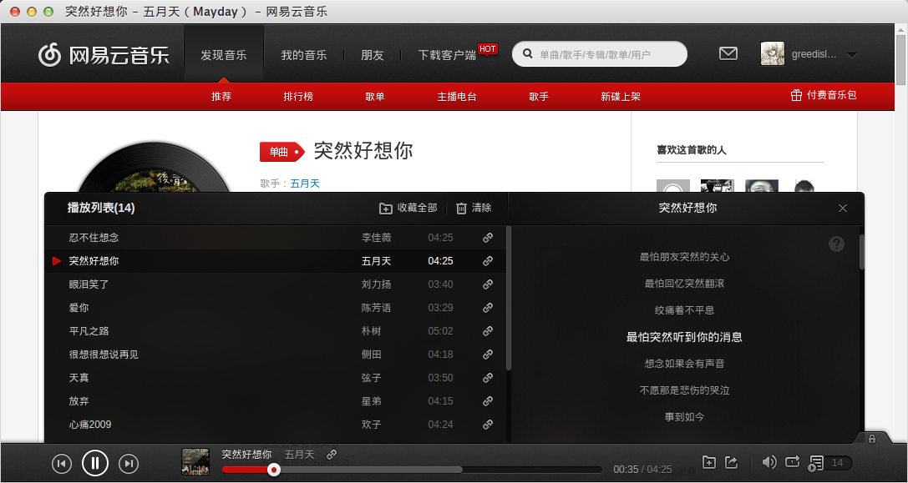

# 网易云音乐Linux版客户端

@(网易云音乐)[Linux|Ubuntu|Nwjs|客户端]

---

[TOC]

---
###关于这个项目
> １、使用Ubuntu已经有很长一段时间，一直对Ubuntu下的音乐软件不感冒。 
> 
> ２、每次听歌都需要打开浏览器，不小心关闭浏览器或者标签就把音乐关掉了。 
> 
> ３、在GitOSC上搜到了[zjuysw](http://git.oschina.net/zjuysw/)的[NetEaseMusic客户端](http://git.oschina.net/zjuysw/NetEaseMusic)，于是萌生了自己做一个客户端的想法。 
> 
> ４、用nwjs把web版本的网易云音乐做了简单包装，效果相当的理想。 
> 
> ５、欢迎大家一起来把这个客户端完善丰富～ 

---
###安装说明
1、把程序拷贝存放的目录（不可以删除，安装后程序就在这个下面了）
2、在终端执行如下命令安装：
``` 
chmod +x generateDesktopIcon.sh
./generateDesktopIcon.sh
```

---
> 备注：安装需要管理员权限，过程中可能会提示输入密码，输入后即可继续安装

###部分效果截图

#####歌曲详情：  


#####好友动态：  


#####收藏列表：  


#####播放列表：  


#####音乐电台：  


---
### 反馈与建议
- 微博：[@张盛翔](http://weibo.com/zhangshx)
- 邮箱：<greedisland1017@163.com>
